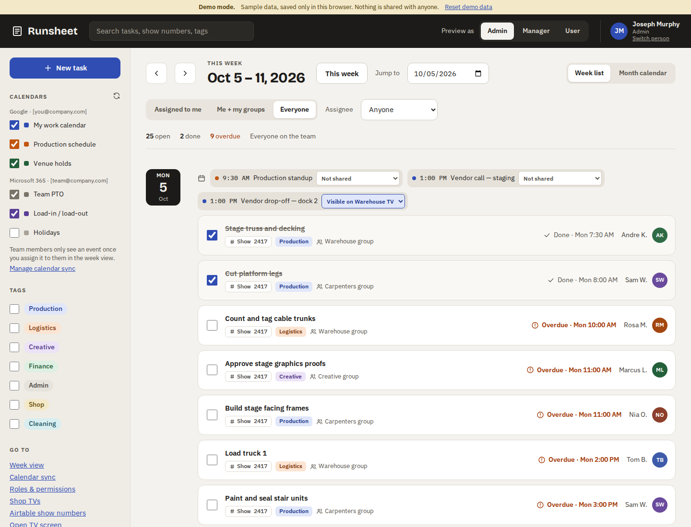
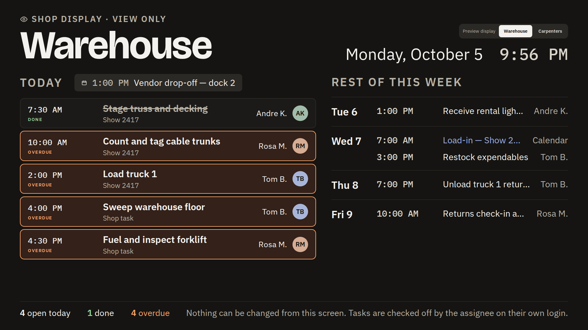
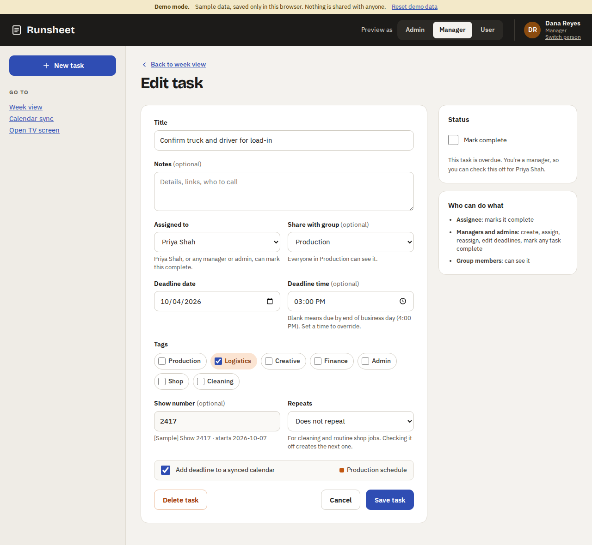

# Runsheet: Work Task Manager

Runsheet is the Fogarty team's task manager, similar to Asana but built around
how we work: shows, load-ins, shop work and cleaning.

- **Fogarty emails only.** People sign in with their Fogarty Google or
  Microsoft account (or an emailed link). Every other address is refused by
  the database itself.
- **Tasks** have an assignee, a deadline (blank time = 4:00 PM), tags, an
  optional group to share with, and a **show number from Airtable**.
- **Check-off rule:** the assignee, or any manager or admin, marks a task
  complete.
- **Roles:** Admin, Manager and User, each seeing and doing different things.
- **Shop TVs** show each group's day on a big, view-only screen that updates
  by itself. Good for show prep and cleaning.
- **Recurring tasks** for daily and weekly cleaning and shop jobs.
- **Calendars:** Google and Microsoft calendar events sit next to the tasks,
  and managers choose who sees each one.



| Shop TV display | Edit task |
|---|---|
|  |  |

## Documentation

| Document | What's in it |
|---|---|
| **[docs/APP_GUIDE.md](docs/APP_GUIDE.md)** | **What the app does**: every screen, role, rule and workflow, with screenshots |
| [docs/SETUP.md](docs/SETUP.md) | Running the demo, publishing on GitHub Pages, and going live (Supabase, Fogarty sign-in, Airtable, TVs) |
| [docs/ARCHITECTURE.md](docs/ARCHITECTURE.md) | How it's built: code layout, data model, security model, tests |
| [mockup/](mockup/) | The original design the app was built from |

## Try it

**Online:** once GitHub Pages is turned on (see [SETUP.md](docs/SETUP.md#b-demo-on-github-pages)):

- Demo app: `https://jmurphy224.github.io/CopyofTaskManager/`
- Mockup: `https://jmurphy224.github.io/CopyofTaskManager/mockup/`

**On your computer:**

```bash
npm install
npm run dev     # open http://localhost:5173
```

With no Supabase settings the app runs in **demo mode**: sample people and
tasks, saved only in your browser. Pick a person to sign in as, and use
**Preview as** to switch between Admin, Manager and User. Open **Open TV
screen** to see the shop display.

## Status

| Area | Status |
|---|---|
| Sign-in (Fogarty only), roles, invites, groups, tags | ✅ Built and tested |
| Tasks: create, assign, share, tags, show numbers, deadlines, check off, recurring | ✅ Built and tested |
| Week list, month calendar, filters, search | ✅ Built |
| Shop TVs: pairing, live display | ✅ Built and tested |
| Airtable show-number sync | ✅ Built (needs Airtable details to switch on) |
| Calendar settings and sharing events | ✅ Built |
| Connecting Google/Microsoft calendars (events in, deadlines out) | ⏳ Next phase |
| Notifications, comments | ⏳ Later |

Open questions before going live:
- The exact Fogarty email domain(s).
- Google Workspace or Microsoft 365?
- Which Airtable base and table hold the show numbers, and their field names.
- Which TVs, for which groups, on what hardware.

## Tech

React + TypeScript (Vite) web app · Supabase (Postgres with row-level
security, Auth, Realtime, Edge Functions) · Airtable API · GitHub Actions for
tests and GitHub Pages.

```bash
npm run typecheck   # TypeScript
npm test            # unit tests
npm run build       # production build
scripts/test-db.sh  # database permission tests (local Postgres)
```

## Repository layout

```
src/                 the web app (see docs/ARCHITECTURE.md)
supabase/            database schema, Airtable sync function, database tests
mockup/              original design: source files, static pages, screenshots
docs/                documentation and screenshots
.github/workflows/   CI (tests on every push) and GitHub Pages publishing
```
