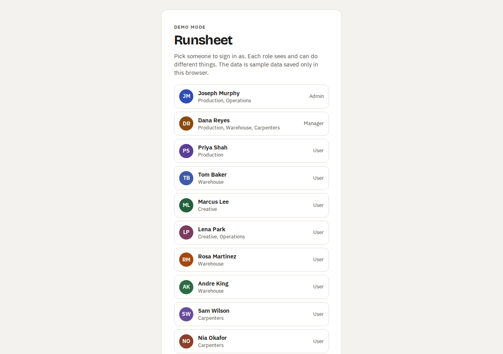
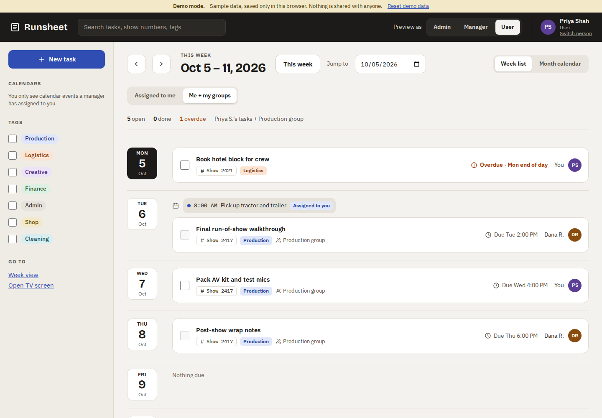
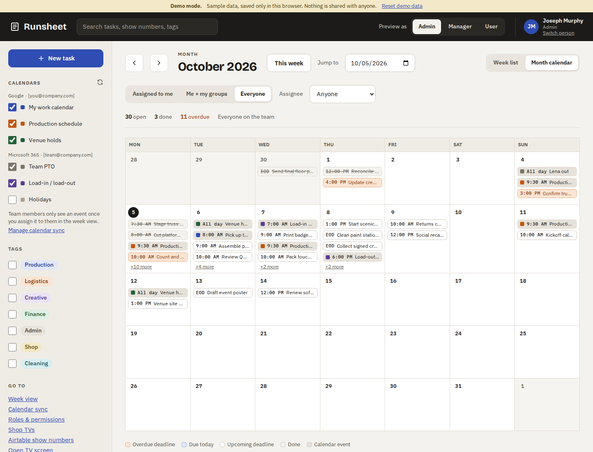
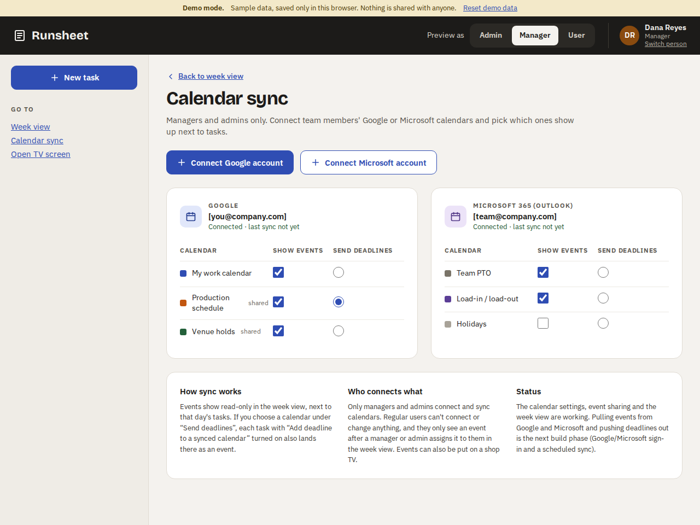
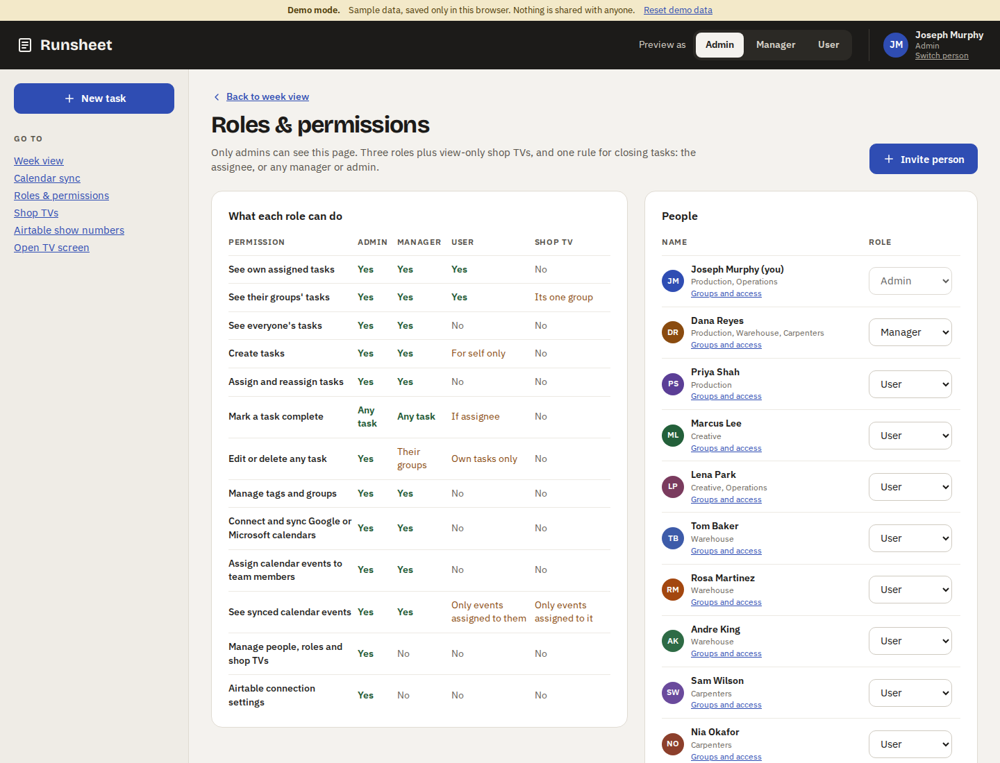
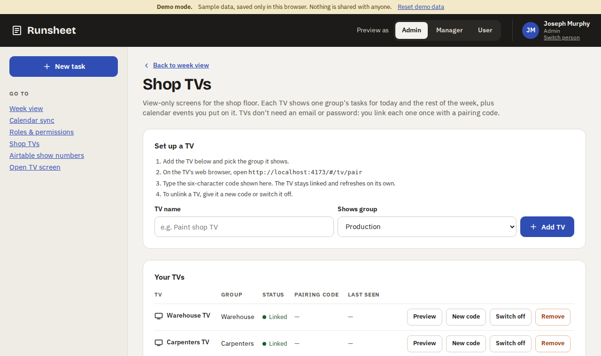
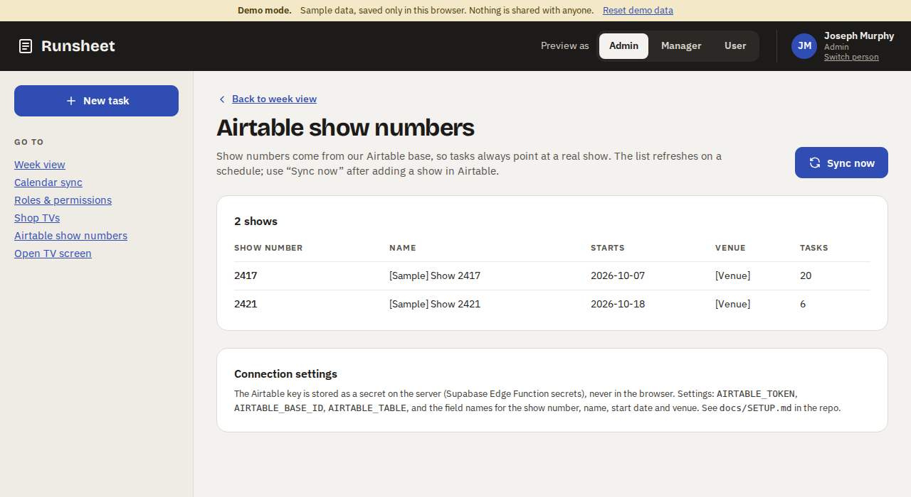
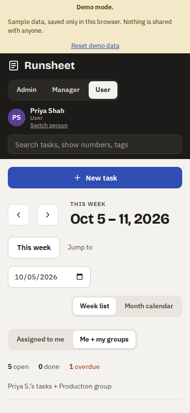

# Runsheet: what the app does

This guide explains everything Runsheet does: who can do what, every screen,
and the rules behind tasks, deadlines, shop TVs, calendars and Airtable show
numbers. It describes the app as built in this repository. Where something is
designed but not built yet, the guide says so.

> Screenshots are from **demo mode**, which uses sample people and tasks.
> All names are made up.

---

## Contents

1. [What Runsheet is for](#1-what-runsheet-is-for)
2. [Demo mode and live mode](#2-demo-mode-and-live-mode)
3. [Signing in (Fogarty emails only)](#3-signing-in-fogarty-emails-only)
4. [Roles](#4-roles)
5. [Groups and tags](#5-groups-and-tags)
6. [Tasks](#6-tasks)
7. [Screen: Week view (home)](#7-screen-week-view-home)
8. [Screen: Month calendar](#8-screen-month-calendar)
9. [Screen: New / edit task](#9-screen-new--edit-task)
10. [Screen: Calendar sync](#10-screen-calendar-sync)
11. [Screen: Roles & permissions](#11-screen-roles--permissions)
12. [Screen: Shop TVs (admin)](#12-screen-shop-tvs-admin)
13. [Screen: Airtable show numbers](#13-screen-airtable-show-numbers)
14. [Screen: Shop TV display](#14-screen-shop-tv-display)
15. [Phones and tablets](#15-phones-and-tablets)
16. [The full permissions table](#16-the-full-permissions-table)
17. [Everyday walkthroughs](#17-everyday-walkthroughs)
18. [What's built and what's next](#18-whats-built-and-whats-next)

---

## 1. What Runsheet is for

Runsheet is the Fogarty team's task list, similar to Asana but built around how
we work: shows, load-ins, shop work and cleaning.

- Everyone signs in with their **Fogarty work email**. Nobody else can get in.
- **Managers** plan the week: they create tasks, assign them, set deadlines and
  tie them to a **show number** from Airtable.
- **Team members** see the tasks assigned to them and to their groups, and
  **check them off** when they're done.
- **Shop TVs** in the warehouse and shop show each group's work for the day on
  a big, view-only screen that updates by itself.
- **Calendars** (Google and Microsoft) put meetings, load-ins and PTO next to
  the tasks.

## 2. Demo mode and live mode

The same app runs two ways:

| | Demo mode | Live mode |
|---|---|---|
| When | No Supabase settings are configured (e.g. the GitHub Pages site) | `VITE_SUPABASE_URL` and `VITE_SUPABASE_ANON_KEY` are set |
| Data | Sample people, tasks and shows, saved **only in that browser** | The shared Fogarty database |
| Sign-in | Pick a person from a list | Fogarty Google or Microsoft account, or an emailed sign-in link |
| Extras | A yellow "Demo mode" bar, **Reset demo data**, and a **Preview as** Admin / Manager / User switch in the top bar | None |

In demo mode the sample "today" is always the real today, so there are always
tasks due today, overdue and coming up. Demo mode follows the **same
permission rules** as the real database, so it's a fair way to try every role.

## 3. Signing in (Fogarty emails only)

**Live mode sign-in options** (which ones appear is a setting):

- **Sign in with Google**: for Fogarty Google Workspace accounts. The Google
  screen is limited to the Fogarty domain.
- **Sign in with Microsoft**: for Fogarty Microsoft 365 accounts.
- **Email me a sign-in link**: type a Fogarty work email and click the link
  that arrives. No password.

**Only Fogarty addresses get in.** The check happens in three places:

1. The sign-in screen refuses any other address before sending anything.
2. **The database refuses to create an account** for any email outside the
   allowed domain list, no matter how the request arrives. This is the rule
   that actually matters.
3. Look-alike addresses (e.g. `fogarty.com@gmail.com`, `x@notfogarty.com`)
   are refused too. Both checks are covered by tests.

**What happens on first sign-in:**

- The **very first person** to sign in becomes an **Admin**, so someone can
  set everything up.
- If an admin **invited** the email, the person gets the role and groups from
  the invite.
- Otherwise they start as a **User** with no groups. An admin can change this.
- There's an optional setting, **require invite**, where only invited emails
  can sign in at all.

**Switching someone off:** an admin can turn off a person's access. They can
still sign in to their Fogarty account, but Runsheet shows *"No access"* and
the database returns nothing to them.

## 4. Roles

| Role | Who it's for | In short |
|---|---|---|
| **Admin** | Team lead / system owner | Everything a manager can do, plus people, roles, shop TVs and the Airtable connection. |
| **Manager** | Department leads, production managers | Plans the work: creates and assigns tasks to anyone, edits tasks in their groups, checks off any task, manages calendars, tags and groups. |
| **User** | Everyone else | Sees their own tasks and their groups' tasks, creates tasks for themselves, checks off tasks assigned to them. |
| **Shop TV** | A screen on the shop floor | Shows one group's tasks and the events put on it. Can't change anything. |

**The one rule for closing tasks:** a task can be checked off by **the person
it's assigned to**, or by **any manager or admin**. Nobody else can. For
everyone else the checkbox is greyed out and explains who can check it off,
e.g. *"Only Dana Reyes, a manager or an admin can mark this complete."*

The full table is in [section 16](#16-the-full-permissions-table).

## 5. Groups and tags

**Groups** are teams of people. The starting groups are Production, Creative,
Operations, Warehouse and Carpenters, and they can be renamed or added to.

- A person can be in several groups.
- **Sharing a task with a group** lets everyone in that group see it. This is
  how show prep and shop work become visible to a whole team.
- Each **shop TV** shows exactly one group.
- Managers and admins create groups. Admins choose who's in each group (on the
  Roles & permissions page, under **Groups and access**).

**Tags** are coloured labels for filtering: Production, Logistics, Creative,
Finance, Admin, Shop and Cleaning to start. A task can have any number of
tags. Managers and admins can add more.

## 6. Tasks

### Fields

| Field | Required | What it does |
|---|---|---|
| **Title** | Yes | Short and action-first, e.g. "Load truck 1". |
| **Notes** | No | Details, links, who to call. |
| **Assigned to** | Yes | One person. Managers and admins can pick anyone. A user's own tasks are always assigned to themselves. |
| **Share with group** | No | Everyone in the group can see the task. If the group has a shop TV, the task shows on that TV. "No group" keeps it between the assignee, managers and admins. |
| **Deadline date** | Yes | The day it's due. |
| **Deadline time** | No | **Blank means end of business day, 4:00 PM.** |
| **Tags** | No | Any number. Used for filtering. |
| **Show number** | No | Ties the task to a show, e.g. `2417`. Suggests numbers from Airtable as you type and shows the show's name. Leave blank for shop and cleaning work: those appear as **"Shop task"** on the TV. |
| **Repeats** | No | Does not repeat / Every day / Every weekday (Mon–Fri) / Every week. See below. |
| **Add deadline to a synced calendar** | No | Marks the task's deadline to be sent to the calendar chosen on the Calendar sync page (shown next to the switch, e.g. "Production schedule"). |

### Status

Each task is always in exactly one state:

| Status | Rule | How it looks |
|---|---|---|
| **Upcoming** | Not done, due on a later day | Grey clock, "Due Wed 2:00 PM" |
| **Due today** | Not done, due today, deadline not passed yet | Blue, "Due today · Mon 3:00 PM" |
| **Overdue** | Not done and the deadline has passed (date + time, or 4:00 PM if no time) | Orange-red, "Overdue · Mon end of day" |
| **Done** | Checked off | Greyed and struck through, "Done · …" |

Statuses refresh by themselves every 30 seconds, so a task turns *Overdue* at
its deadline without anyone reloading the page.

**Done tasks record who checked them off and when.** This appears on the task's
page, e.g. "Done by Priya Shah on 10/5/2026, 2:14 PM". Unchecking a task clears
it.

### Recurring tasks (cleaning and routine shop jobs)

When a repeating task is checked off, Runsheet creates **the next copy** with
the same title, assignee, group, tags, show and time:

- **Every day**: next day.
- **Every weekday**: next Monday–Friday (Friday → Monday).
- **Every week**: same weekday next week.
- **Never in the past.** If a daily task is finished three days late, the next
  copy is due today rather than in the past.
- **Only one copy.** Unchecking and re-checking the same task doesn't create a
  second copy.

## 7. Screen: Week view (home)

This is where everyone starts after signing in.

**Top bar:** search box, the person signed in (name, role, sign out), and in
demo mode the **Preview as** switch.

**Week header:**
- **◀ ▶** move a week back or forward. **This week** jumps back to today's week.
- **Jump to** picks any date and shows its week (weeks run Monday–Sunday).
- The title reads e.g. *THIS WEEK · Oct 5 – 11, 2026*, with *Next week* and
  *Last week* labels when they apply.
- **Week list / Month calendar** switches layouts.

**Whose tasks** (top-left switch):

| Option | Shows | Who has it |
|---|---|---|
| **Assigned to me** | Only your tasks | Everyone |
| **Me + my groups** | Your tasks plus everything shared with your groups | Everyone (default for users) |
| **Everyone** | Every task | Managers and admins (their default) |

Managers and admins also get an **Assignee** drop-down to show one person's tasks.

**Counters** under the filters show how many tasks in view are **open**,
**done** and **overdue**, plus a note of what's being shown (e.g. "Priya S.'s
tasks + Production group · tagged Logistics").

**Each day** shows:
- A date badge. Today's is dark.
- A row of **calendar events** for that day, with a coloured dot for the
  calendar and the time (or *All day*). For managers and admins, each event
  has a **who can see** menu: *Not shared*, *Visible to <person>*, or
  *Visible on <TV>*. Users only see events shared with them, marked
  *Assigned to you*.
- The day's **tasks** in deadline order, each with a checkbox, title (click it
  to open the task), show number, tags, group, repeat note, due text and the
  assignee's initials.
- *Nothing due* if the day is empty.

**Sidebar:**
- **New task** button.
- **Calendars** (managers and admins): each connected account and its
  calendars, with a checkbox to show or hide that calendar's events, plus a
  link to Calendar sync. Users see *"You only see calendar events a manager
  has assigned to you."*
- **Tags:** tick one or more to show only tasks with those tags. **Clear**
  removes the filter.
- **Go to:** links to the other pages this person can open.

**Search** matches task titles, notes, show numbers, tag names, assignee names
and group names, plus calendar event titles.

The current week, layout and filters are kept in the page address, so a link
to a filtered view can be bookmarked or shared.

**What a user sees.** Priya (a user in Production) sees only her tasks and her
group's, has no *Everyone* option, and can't tick other people's tasks:

## 8. Screen: Month calendar

- A Monday–Sunday grid for the month, with today circled.
- Each day lists events and tasks in time order, colour-coded: **orange** =
  overdue, **blue** = due today, **white** = upcoming, **grey, struck through**
  = done, **beige with a dot** = calendar event. A legend sits underneath.
- Hover an item for details (status, deadline, title, assignee). Click a task
  to open it.
- Up to four items show per day. **+N more** opens that week in the week list.
- **◀ ▶** move a month at a time. The counters cover the whole month.

## 9. Screen: New / edit task

Opened with **New task**, or by clicking a task's title.

- The fields are as described in [Tasks › Fields](#fields), with hints under
  each. Examples: who can check it off, who can see it given the group (*and
  which TV it will show on*), the 4:00 PM rule, and the show's name from
  Airtable (or a warning if the number isn't in the Airtable list).
- **Users** can only assign tasks to themselves, and can only share with
  groups they're in.
- **Save task / Create task** saves and returns to that task's week.
  **Cancel** goes back without saving. **Delete task** (with a confirmation)
  appears for people allowed to delete it.
- **Status panel** (existing tasks): the **Mark complete** checkbox, who
  finished it and when, and an explanation of whether you can check it off.
- **View only:** if you can see a task but not change it (e.g. a groupmate's
  task), the form is greyed out and a note explains who can edit it.
- **Who can do what** panel: a short reminder of the rules.

## 10. Screen: Calendar sync

Managers and admins only.

- One card per connected **Google** or **Microsoft 365** account, with the
  last sync time.
- For each calendar:
  - **Show events** puts its events in the week view and month calendar.
  - **Send deadlines** chooses the **one** calendar that receives task
    deadlines (picking one clears the others).
- How sharing works: events are hidden from users until a manager shares one
  with a person or a TV from the week view.

**Not built yet:** actually connecting Google and Microsoft accounts and
copying events in and deadlines out. The **Connect** buttons explain this. The
screen, the settings and event sharing all work today on events stored in
Runsheet. See [section 18](#18-whats-built-and-whats-next).

## 11. Screen: Roles & permissions

Admins only.

- **What each role can do:** the full permissions table (the same as
  [section 16](#16-the-full-permissions-table)).
- **People:** everyone, with their groups and a **Role** drop-down that changes
  their role straight away. You can't change your own role, so an admin can't
  accidentally lock themselves out.
- **Groups and access** (under each name): tick the groups the person belongs
  to, and **Switch off access** / **Turn access back on**.
- **Invite person:** name, Fogarty email, role and groups. In live mode, a
  non-Fogarty address is refused. When the person first signs in they get
  that role and those groups. Pending invites are listed with **Cancel invite**.
- **Groups** and **Tags:** see the current ones (with member counts) and add
  new ones.

## 12. Screen: Shop TVs (admin)

Admins only. This is where TVs are set up.

1. **Add TV**: give it a name (e.g. "Paint shop TV") and the group it shows.
2. Runsheet shows a **six-character pairing code**.
3. On the TV's web browser, open the pairing address shown on the page
   (`…/#/tv/pair`) and type the code.
4. The TV is now **linked**. It stays signed in (no email or password), and
   the code is used up.

For each TV the table shows its group, status (*Linked*, *Waiting for
pairing*, *Switched off*), its code, and when it last checked in. Buttons:
- **New code**: unlinks whatever TV was using it and makes a fresh code.
- **Switch off / Switch on**: a switched-off TV shows *"Display not
  available"*.
- **Remove**: deletes the TV.
- **Preview** (demo mode): opens that TV's screen.

**Security:** a TV holds a long random key. The database stores only a
scrambled (hashed) copy, which can't be read back through the app. A TV can
only ever see its own group's tasks and the events put on it, nothing else.

## 13. Screen: Airtable show numbers

Admins only.

- The list of shows brought in from Airtable: **show number**, **name**,
  **start date**, **venue**, and how many tasks use it.
- **Sync now** fetches the latest list from Airtable straight away and reports
  e.g. *"Synced 42 shows from Airtable."* The list also refreshes on a
  schedule (hourly is suggested; see [SETUP.md](SETUP.md)).
- Rows in Airtable with no show number are skipped and counted in the message.
- The Airtable key lives only on the server, never in anyone's browser.
- The task form uses this list to suggest show numbers and to warn about a
  number that isn't in Airtable.

## 14. Screen: Shop TV display

A full-screen, dark, view-only page for the shop floor, designed for a
1920×1080 TV and readable from across the room.

- **Header:** "SHOP DISPLAY · VIEW ONLY", the group name in large type, and
  today's date with a clock.
- **Today** (left): the group's tasks for today in deadline order. Each row
  shows the time, status (**Done** in green, **Overdue** in orange, **Due
  today** in blue), the title, the show number or *"Shop task"*, and who it's
  assigned to. Overdue rows are outlined in orange and done rows are struck
  through. Calendar events put on this TV appear next to the *Today* heading.
  Rows get smaller when the day is busy, and anything past seven tasks shows
  as *"+N more today"*.
- **Rest of this week** (right): the next five days, listing each day's tasks
  (with show numbers and assignees) and calendar events (in blue, marked
  *Calendar*).
- **Footer:** counts of **open today**, **done** and **overdue**, and the
  reminder *"Nothing can be changed from this screen. Tasks are checked off by
  the assignee on their own login."*
- **Refreshes by itself** every 30 seconds, and the clock ticks. Nobody needs
  to touch the TV. If the connection drops it keeps the last data and shows
  *Reconnecting…*.
- In demo mode, a **Preview display** switch flips between the Warehouse and
  Carpenters TVs.

**Hardware:** any TV with a full-screen web browser works: a smart-TV browser,
a Fire TV Stick, or a small PC or Raspberry Pi in kiosk mode.

## 15. Phones and tablets

Every screen works at phone width. On narrow screens the top bar wraps, a
**New task** button sits above the week, days stack vertically, and the
calendars, tags and page links move below the task list.

## 16. The full permissions table

The database enforces all of these rules, so they hold even if someone tries
to get around the screens. They're checked by 43 automated database tests
(`supabase/tests/rls_test.sql`).

| Permission | Admin | Manager | User | Shop TV |
|---|:-:|:-:|:-:|:-:|
| See own assigned tasks | Yes | Yes | Yes | No |
| See their groups' tasks | Yes | Yes | Yes | Its one group |
| See everyone's tasks | Yes | Yes | No | No |
| Create tasks | Yes | Yes | For self only | No |
| Assign and reassign tasks | Yes | Yes | No | No |
| Mark a task complete | Any task | Any task | If assignee | No |
| Edit or delete a task | Any task | Tasks in their groups (and ungrouped tasks they created or are assigned) | Tasks they created for themselves | No |
| Manage tags and groups | Yes | Yes | No | No |
| Connect and sync Google or Microsoft calendars | Yes | Yes | No | No |
| Share calendar events with people or TVs | Yes | Yes | No | No |
| See synced calendar events | Yes | Yes | Only events shared with them | Only events put on it |
| Manage people, roles, invites and shop TVs | Yes | No | No | No |
| Airtable connection and sync | Yes | No | No | No |

## 17. Everyday walkthroughs

**A manager plans show prep for Show 2417**
1. Clicks **New task**.
2. Title "Confirm truck and driver for load-in", assigned to Priya, shared with
   **Production**, deadline Monday 3:00 PM, tag **Logistics**, show **2417**
   (the hint confirms the show's name from Airtable).
3. Turns on **Add deadline to a synced calendar** (Production schedule).
4. **Create task**. Priya and the rest of Production now see it in
   *Me + my groups*.

**A team member finishes a task**
1. Opens Runsheet on their phone and signs in with their Fogarty account.
2. Ticks the box next to the task. It turns **Done** and the counters update.
   The shop TV for that group updates on its next refresh.

**A daily cleaning job on the Warehouse TV**
1. A manager creates "Sweep warehouse floor", assigns it to Tom, shares it with
   **Warehouse**, tags it **Cleaning**, leaves the time blank (due 4:00 PM) and
   sets **Repeats: Every weekday**.
2. It appears on the Warehouse TV under **Today** as a *Shop task*. If it isn't
   done by 4:00 PM it turns **Overdue**.
3. When Tom ticks it off on his phone, tomorrow's copy is created
   automatically.

**Putting a delivery on the shop TV**
1. A manager finds "Vendor drop-off — dock 2" in the week view's calendar
   events.
2. In its **who can see** menu, picks **Visible on Warehouse TV**.
3. It appears next to *Today* on the Warehouse TV.

**An admin adds a new hire**
1. **Roles & permissions** › **Invite person**: name, Fogarty email, role
   *User*, group *Carpenters*.
2. The new hire signs in with their Fogarty account and immediately sees the
   Carpenters' tasks.

**Setting up a new TV**
1. **Shop TVs** › add "Paint shop TV" for the *Carpenters* group, and note the
   code (e.g. `C4B6DU`).
2. On the TV, open the pairing address and type the code. Done.

## 18. What's built and what's next

**Built and tested:**
- Fogarty-only sign-in (Google, Microsoft, emailed link), with the domain
  rule enforced by the database
- First-admin setup, invites, roles, groups, switching access off
- Tasks: create, edit, delete, assign, share with a group, tags, show numbers,
  4:00 PM default deadline, statuses, check off / uncheck, who-finished-it
- Recurring tasks (daily, weekdays, weekly)
- Week list, month calendar, filters, search, counters, shareable filtered links
- Calendar settings and sharing events with people or TVs
- Shop TVs: pairing codes, live view-only screen, switch off and re-pair
- Airtable show-number sync (server-side) with *Sync now*
- Demo mode with sample data, published to GitHub Pages
- Database permission tests (43) and app tests, run on every push

**Next:**
1. **Calendar connection:** sign in to Google and Microsoft from the Calendar
   sync page, copy events in on a schedule, and send deadlines out to the
   chosen calendar. The tables and screens are ready for it.
2. **Notifications:** an email or phone alert when you're assigned a task or
   one goes overdue.
3. **Comments** on tasks.
4. **A task list per show** (all tasks for Show 2417 in one place), and
   optionally writing completion back to Airtable.
5. **Shop TV extras:** optionally allowing taps to check off tasks on a
   touchscreen TV.
