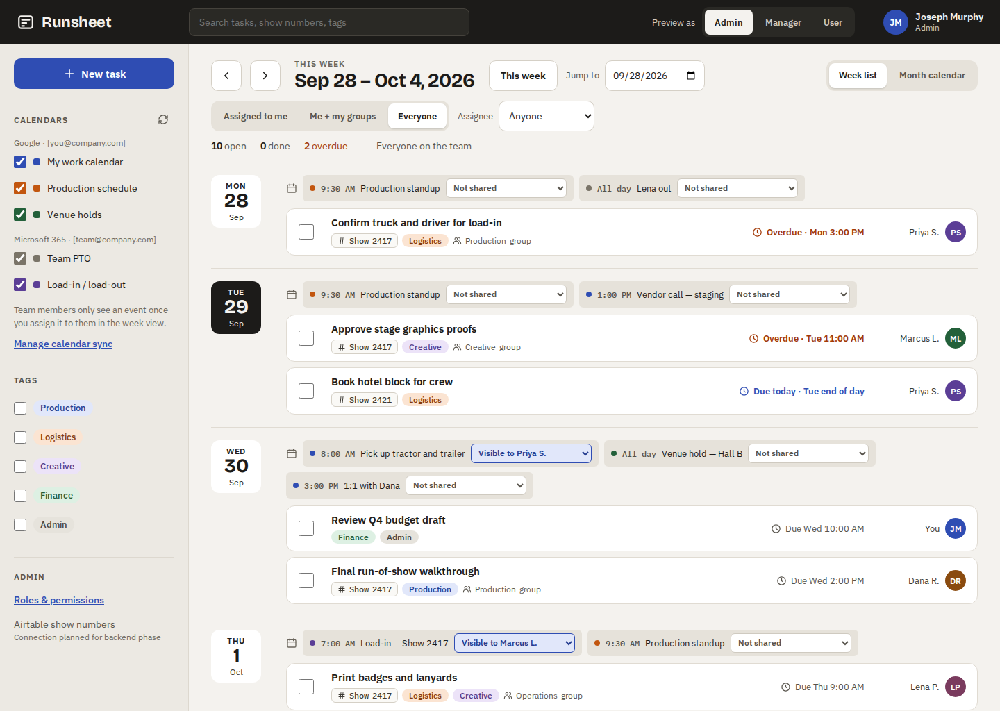
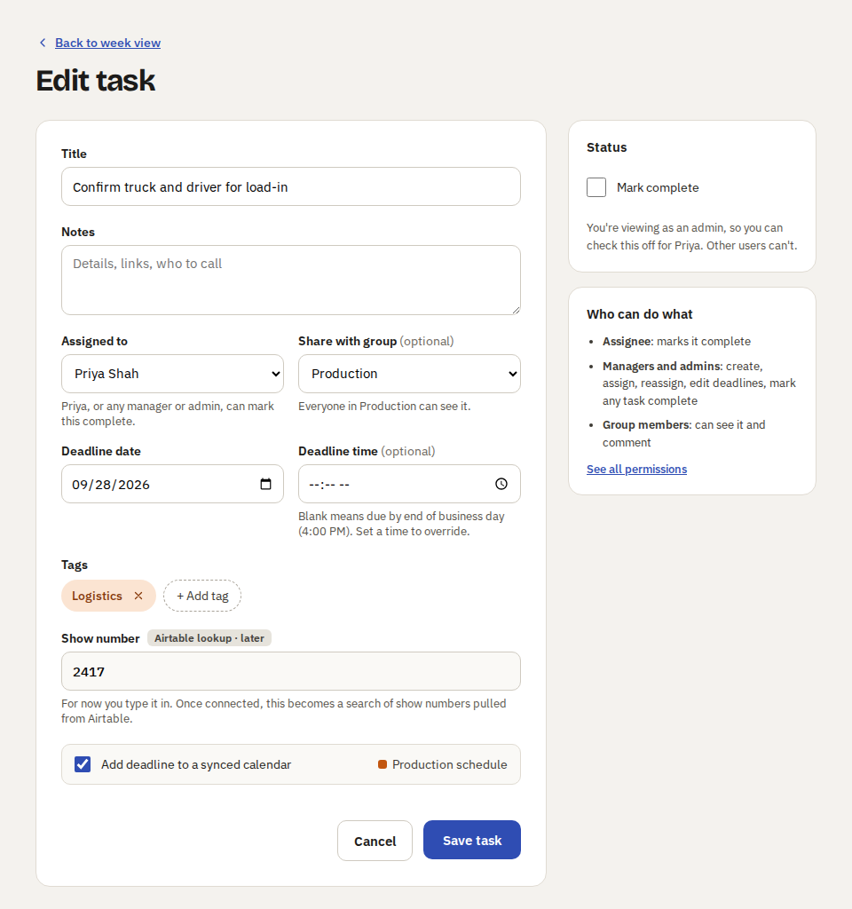
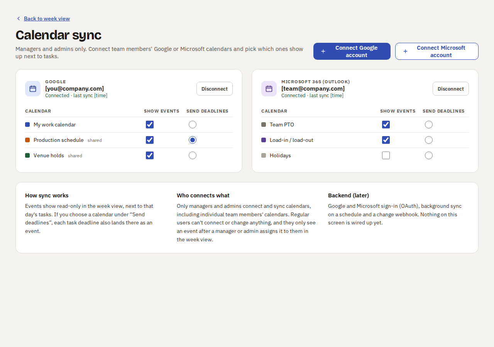
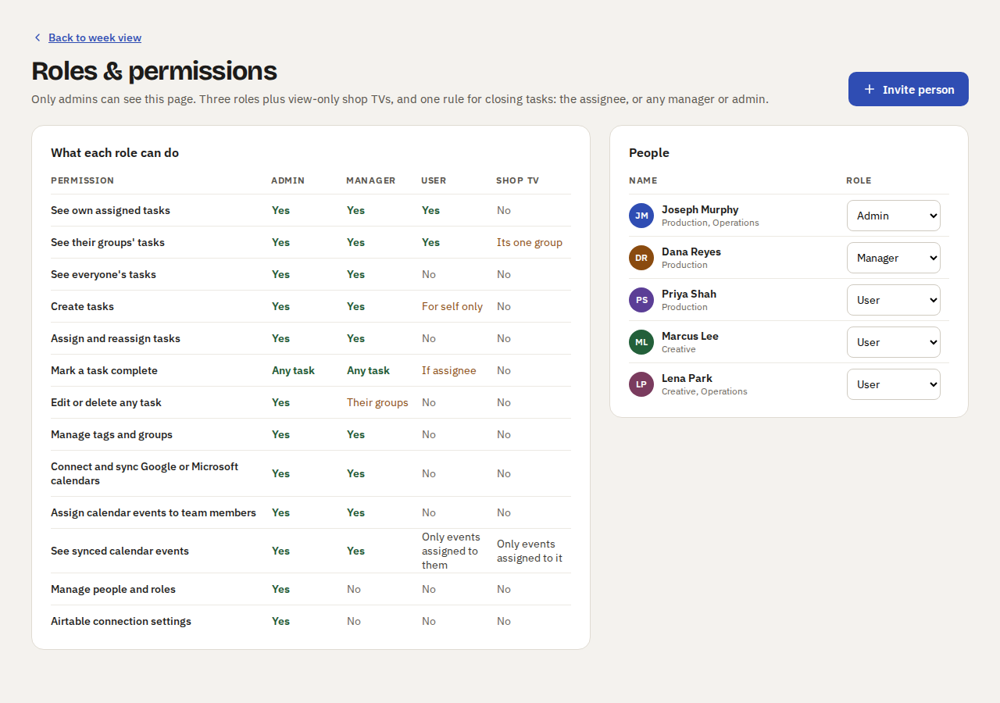
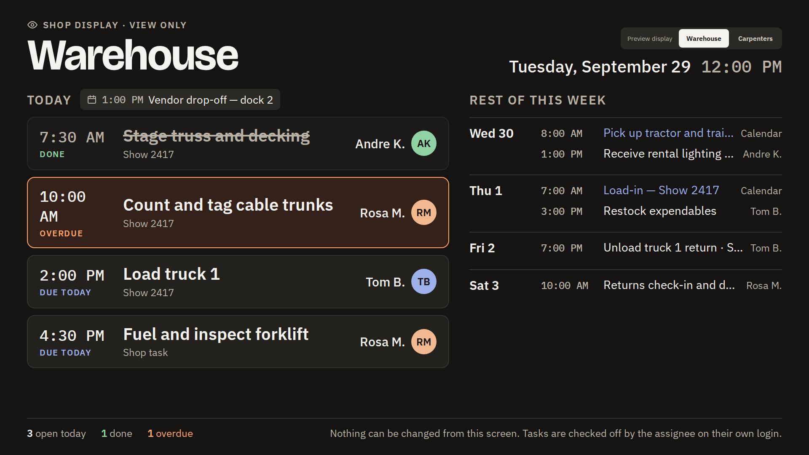

# Runsheet mockup

The original design the app was built from. It has five screens:

| Screen | Static page | Screenshot |
|---|---|---|
| Week view | [pages/Main.html](pages/Main.html) |  |
| Create / edit task | [pages/TaskDetail.html](pages/TaskDetail.html) |  |
| Calendar sync | [pages/Calendars.html](pages/Calendars.html) |  |
| Roles & permissions | [pages/Roles.html](pages/Roles.html) |  |
| Shop TV display | [pages/TV.html](pages/TV.html) |  |

- **`pages/`** has standalone HTML copies. They open in any browser, and links
  between screens work, but buttons and checkboxes are frozen. GitHub shows
  their code rather than rendering them. Download them, or use the GitHub
  Pages preview at `…/mockup/` (see [docs/SETUP.md](../docs/SETUP.md#b-demo-on-github-pages)).
- **`screenshots/`** has a picture of each screen.
- **`source/`** has the design-canvas source files (`.dc.html` plus
  `canvas.json`). They only render inside the Claude design canvas. The live,
  clickable mockup is at https://claude.ai/artifact/5nokR4iRFrvGcD13A2iGWc
- **`index.html`** is the gallery page used by the GitHub Pages preview.
